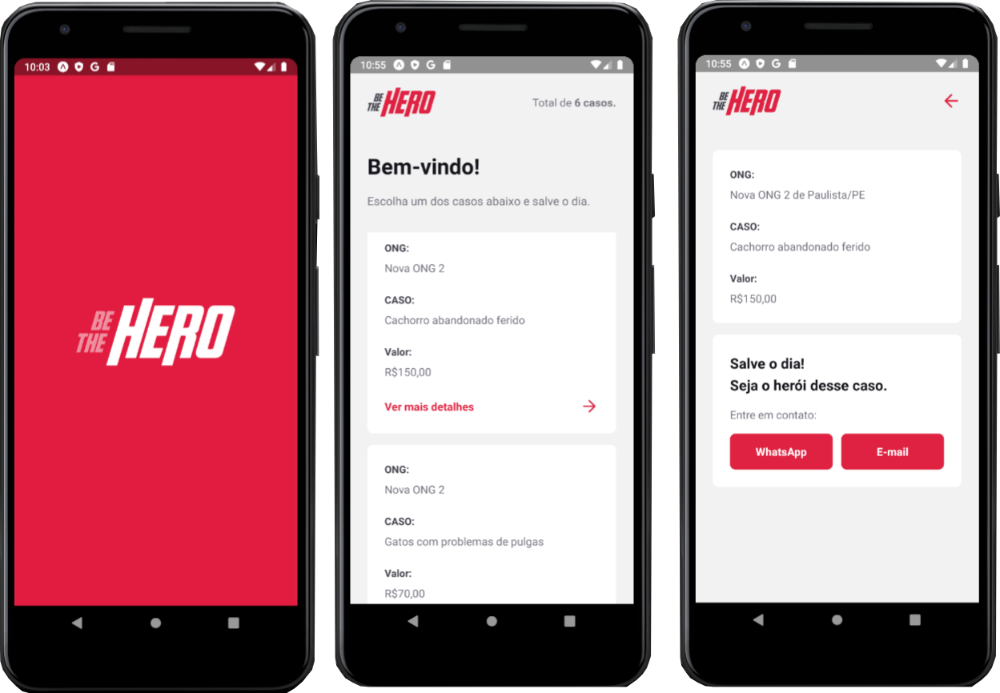

<h1 align="center">
    
</h1>

<h2 align="center">
  🚀 Semana Omnistack 11.0
</h2>
<p align="center">
  <a href="https://rocketseat.com.br">
    
  </a>
  
</p>

<p align="center">
  <a href="#rocket-tecnologias">Tecnologias</a>&nbsp;&nbsp;&nbsp;|&nbsp;&nbsp;&nbsp;
  <a href="#pushpin-projeto">Projeto</a>&nbsp;&nbsp;&nbsp;|&nbsp;&nbsp;&nbsp;
  <a href="#art-layout">Layout</a>&nbsp;&nbsp;&nbsp;|&nbsp;&nbsp;&nbsp;
  <a href="#file_folder-file-insomnia">File Insomnia</a>&nbsp;&nbsp;&nbsp;|&nbsp;&nbsp;&nbsp;
  <a href="#computer-instalacao">Instalação</a>&nbsp;&nbsp;&nbsp;|&nbsp;&nbsp;&nbsp;
  <a href="#thinking-como-contribuir">Como contribuir</a>&nbsp;&nbsp;&nbsp;|&nbsp;&nbsp;&nbsp;
  <a href="#memo-licença">Licença</a>
</p>

<br>

## :rocket: Tecnologias

Esse projeto tem como base as seguintes tecnlogias:

- [Node.js](https://nodejs.org/en/)
- [React](https://reactjs.org)
- [React Native](https://facebook.github.io/react-native/)
- [Expo](https://expo.io/)
- [SQLite](https://www.sqlite.org/index.html)
- [Jest](https://jestjs.io/)

Extras:

- Main Libs
  - [Express](https://expressjs.com/pt-br/)
  - [Axios](https://github.com/axios/axios)
  - [Nodemon](https://nodemon.io/)
  - [Cors](https://www.npmjs.com/package/cors)
  - [KnexJS](http://knexjs.org/)
  - [Toast Notification](https://github.com/jossmac/react-toast-notifications)
- Estilos
  - [EditorConfig](https://editorconfig.org/)
  - [ESLint](https://eslint.org/)
  - [Prettier](https://prettier.io/)
- Softwares
  - [VSCode](https://code.visualstudio.com/)
  - [Insomnia REST Client](https://insomnia.rest/)

##  :pushpin: Projeto

O **Be The Hero** é um projeto que visa conectar pessoas interessadas em ajudar ongs com campanhas abertas. 

O projeto conta com um aplicativo onde o usuário pode se tornar o héroi dos casos disponibilizados pelas ONGS. Também conta com site destinado as ongs, onde cada ONG poderá cadastrar casos com as devidas informações, valores necessitados e meios de contato, assim como poderá também excluir o caso se necessário for.  

## :art: Layout

> Versão mobile --- Hérois (usuários)




<br>

> Versão web --- Ongs


 

## :file_folder: File Insomnia

O arquivo `.json` com o arquivo usado no Insomnia está dentro da pasta **files**. Basta fazer o download e importar no insomnia e usar. Lembre de alterar o que for necessário para que você consiga efetuar as requisições. 

## :computer: Instalação

O **Backend** foi construido em NodeJS, certifique-se de ter alguma versão do node instalada em sua máquina. Utilize o Insomnia para realizar os testes na API. 
<br>
Iniciando o backend: <br>
```bash
cd backend
npm install
npm start
```
Iniciando o **Frontend** em **ReactJS**:
<br>
```bash
cd frontend
npm install
npm start
```
Assim que o processo terminar, automaticamente será aberta no seu navegador a página `localhost:3000` contendo o Projeto.  

Iniciando com o **Mobile** em **React Native**
1. Coloque o endereço do seu servidor (ou computador) no arquivo `src/services/api.js`
2. Execute os comandos:
```bash
# NÃO é preciso executar a linha de baixo caso ja tenha o Expo (CLI) instalado!
npm install -g expo-cli
cd mobile
npm install
expo start
```
Será aberta no seu navegador a página `localhost:19002`. Conecte seu emulador, ou teste o aplicativo por `LAN`: baixe o aplicativo *Expo* da Play Store ou App Store e em seguida escaneie o código QR.


## :thinking: Como contribuir

- Faça um fork desse repositório;
- Cria uma branch com a sua feature: `git checkout -b minha-feature`;
- Faça commit das suas alterações: `git commit -m 'feat: Minha nova feature'`;
- Faça push para a sua branch: `git push origin minha-feature`.

Depois que o merge da sua pull request for feito, você pode deletar a sua branch.

## :memo: Licença

Esse projeto está sob a licença MIT. Veja o arquivo [LICENSE](LICENSE.md) para mais detalhes.

---

Feito com ❤️ by **Stefany Sá**
